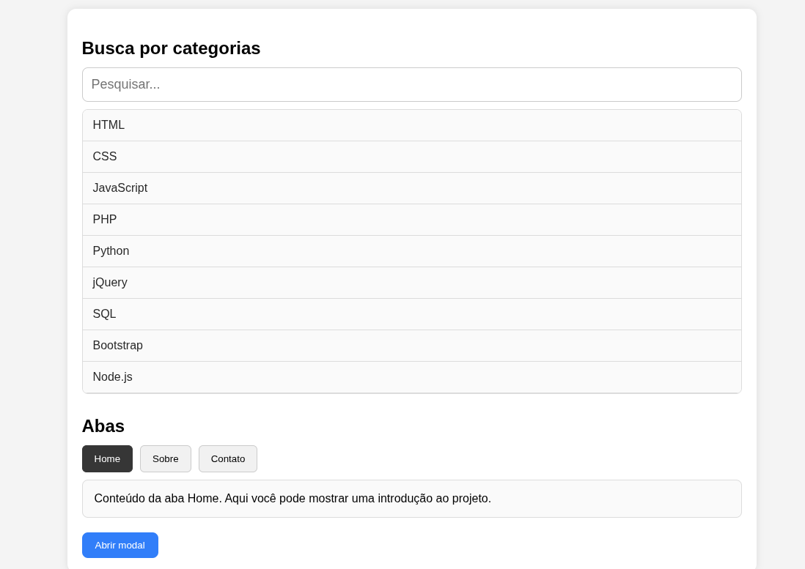

# Atividade 02 - Combinação de Recursos na Interface do Usuário

**Aluno:** Leonardo de Paula Ferreira  
**Turma:** 04AN  
**Professor:** Claudio Alexandre Gananca  
**Instituição:** Universidade Municipal de São Caetano do Sul - USCS  
**Curso:** ADS - Análise e Desenvolvimento de Sistemas  
**Disciplina:** Padrões de Usabilidade e Desenvolvimento de Interfaces  
**Data de entrega:** 17/09/2026

# AF02 Interface

Projeto de interface web em HTML, CSS e JavaScript com exemplos de componentes interativos para estudo e demonstração.

## Demonstração



## Objetivo

Este projeto tem como finalidade apresentar recursos de interface do usuário, incluindo:

- busca e filtro de itens
- navegação por abas
- modal com abertura e fechamento
- layout simples e responsivo
- uso de HTML sem necessidade de framework

## Tecnologias utilizadas

- HTML5
- CSS3
- JavaScript

## Como executar

### Opção 1: abrir diretamente no navegador
- Localize o arquivo HTML do projeto no diretório raiz
- Clique duas vezes no arquivo para abrir no navegador

### Opção 2: usar um servidor local
No terminal, dentro da pasta do projeto, execute:

```bash
python3 -m http.server 8000
```

Depois acesse no navegador:

```bash
http://localhost:8000/
```

## Estrutura do projeto

```text
af02-interface/
├── README
├── recursos-interface.html
└── outros arquivos ou estilos usados pela página
```

## Funcionalidades

- Campo de pesquisa para filtrar itens da lista
- Abas de navegação com conteúdo alternado
- Botão para abrir e fechar um modal
- Interface visual limpa e fácil de entender

## Observações

Este é um projeto estático, sem backend, ideal para aprendizado de front-end básico e prática com manipulação do DOM em JavaScript.

Desenvolvido para fins acadêmicos e de demonstração de interface.
